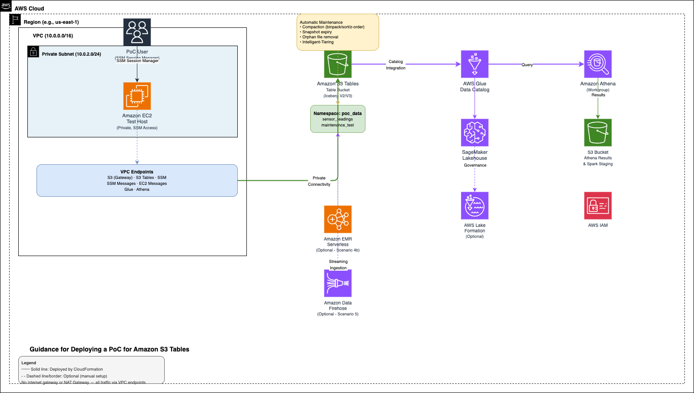

# Guidance for Deploying a PoC for Amazon S3 Tables

## Table of Contents

1. [Overview](#overview)
2. [Architecture](#architecture)
3. [Cost](#cost)
4. [Prerequisites](#prerequisites)
5. [Deployment Steps](#deployment-steps)
6. [PoC Methodology and Success Criteria](#poc-methodology-and-success-criteria)
7. [Test Scenarios](#test-scenarios)
8. [SME Guidance](#sme-guidance)
9. [Cleanup](#cleanup)
10. [Notices](#notices)

---

## Overview

### Business Case

Customers evaluating Amazon S3 Tables for analytics workloads face a common challenge: there's no quick, standardized way to deploy a working environment and validate the service against their requirements. Without guidance, customers often misconfigure PoC environments (permissions, catalog integration, table creation), spend weeks on setup instead of testing, miss key evaluation dimensions (compaction, multi-engine access, streaming ingestion), and draw incorrect conclusions from poorly configured evaluations.

This PoC guide solves these problems by:

- **Accelerating time-to-decision** — reduces PoC setup from weeks to hours with a CloudFormation template and step-by-step tested instructions
- **Improving PoC outcomes** — ensures customers evaluate S3 Tables in an optimally configured environment, leading to fair evaluations
- **Reducing AWS engagement overhead** — customers can self-serve the PoC without requiring specialist involvement for setup and configuration
- **Decreasing stop-start cycles** — provides a complete end-to-end guide covering deployment, test scenarios, troubleshooting, and cleanup
- **Enabling informed architectural decisions** — includes SME guidance comparing S3 Tables vs self-managed Iceberg with a decision framework

### What This Guidance Deploys

This Guidance helps users deploy and configure an optimal proof-of-concept (PoC) environment for **Amazon S3 Tables**. Amazon S3 Tables deliver the first cloud object store with built-in Apache Iceberg support, providing a fully managed, Iceberg-native storage layer optimized for analytics workloads. S3 Tables automatically handle table maintenance operations such as compaction, snapshot management, and unreferenced file removal — delivering up to 3x faster query performance and up to 10x more transactions per second compared to self-managed Iceberg tables.

Using this Guidance, you can quickly deploy a PoC environment that allows you to:

- Create and manage S3 table buckets and namespaces
- Ingest data into Apache Iceberg tables (V2 and V3) on S3 Tables
- Query tables using Amazon Athena, Amazon EMR Serverless, or Apache Spark
- Evaluate automated table maintenance (compaction, snapshot expiry, unreferenced file removal, record expiration)
- Test sort order and z-order compaction strategies
- Test integration with AWS analytics services via Amazon SageMaker Lakehouse
- Evaluate Intelligent-Tiering for cost optimization on mixed-access-pattern tables

### Target Use Cases

- Data lake analytics with Apache Iceberg
- Streaming and batch data ingestion and analytics
- Data warehouse offloading to open table formats
- Multi-engine analytics (Athena, Redshift, EMR Serverless, Spark)

### AWS Services Deployed

| Service | Purpose |
|---|---|
| Amazon S3 Tables | Managed Iceberg table storage |
| Amazon Athena | Serverless SQL query engine |
| AWS Glue Data Catalog | Metadata catalog for table discovery |
| AWS Lake Formation | Fine-grained access control |
| Amazon EC2 | Access point for Spark-based testing |
| Amazon VPC | Isolated network environment |
| AWS IAM | Identity and access management |

---

## Architecture



The CloudFormation template deploys the following architecture:

```
┌─────────────────────────────────────────────────────────┐
│                        VPC                              │
│  ┌───────────────────────────────────────────────────┐  │
│  │              Private Subnet                       │  │
│  │  ┌──────────────┐                                 │  │
│  │  │  EC2 Instance│ ◄── SSM Session Manager         │  │
│  │  │  (Test Host) │     (no public IP, no SSH)      │  │
│  │  └──────┬───────┘                                 │  │
│  └─────────┼─────────────────────────────────────────┘  │
│            │                                            │
│  ┌─────────┴─────────────────────────────────────────┐  │
│  │  VPC Endpoints                                    │  │
│  │  S3 (Gateway) · S3 Tables · SSM · SSM Messages    │  │
│  │  EC2 Messages · Glue · Athena                     │  │
│  └───────────────────────────────────────────────────┘  │
└────────────┼────────────────────────────────────────────┘
             │
             ▼
┌────────────────────────┐    ┌──────────────────────────┐
│  Amazon S3 Tables      │◄──►│  AWS Glue Data Catalog   │
│  (Table Bucket)        │    │  (SageMaker Lakehouse    │
│  - Namespace           │    │   Integration)           │
│  - Iceberg Tables      │    └──────────┬───────────────┘
└────────────────────────┘               │
                                         ▼
                              ┌──────────────────────┐
                              │   Amazon Athena      │
                              │   (Query Workgroup)  │
                              └──────────────────────┘
```

1. An EC2 instance is deployed in a **private subnet** with no public IP. Access is via AWS Systems Manager Session Manager.
2. **VPC endpoints** provide private connectivity to AWS services (S3, S3 Tables, SSM, Glue, Athena) — no NAT Gateway or internet gateway required.
3. An S3 table bucket is created with a default namespace for organizing Iceberg tables.
4. The table bucket is integrated with AWS Glue Data Catalog via SageMaker Lakehouse for unified access.
5. Amazon Athena is configured with a dedicated workgroup and S3 results bucket for serverless SQL queries.
6. IAM roles provide least-privilege access to S3 Tables, Glue, Athena, and Lake Formation.

---

## Cost

You are responsible for the cost of the AWS services used while running this PoC. As of March 2026, the estimated cost for running this PoC in **US East (N. Virginia)** with default settings is approximately **$5–15 per day**, depending on usage patterns.

| Service | Estimated Daily Cost | Notes |
|---|---|---|
| Amazon S3 Tables | ~$0.50–$2.00 | Storage + PUT/GET requests |
| Amazon Athena | ~$0–$5.00 | $5 per TB scanned |
| Amazon EC2 (t3.xlarge) | ~$4.00 | On-demand pricing |
| VPC Interface Endpoints (6) | ~$1.50 | $0.01/hr per endpoint per AZ |
| Amazon EMR Serverless (optional) | ~$1–3 | Pay-per-use, only if running Scenario 4b |
| AWS Glue Data Catalog | ~$0.00 | Free tier covers most PoC usage |

> **Tip:** Stop or terminate the EC2 instance when not actively testing to minimize costs.

---

## Prerequisites

- An AWS account with permissions to create IAM roles, VPCs, EC2 instances, S3 table buckets, Athena workgroups, and Glue resources.
- AWS CLI v2 installed locally (for deployment and SSM Session Manager access).
- The [Session Manager plugin](https://docs.aws.amazon.com/systems-manager/latest/userguide/session-manager-working-with-install-plugin.html) installed for your AWS CLI.
- **Lake Formation data lake administrator** — the deploying principal must be registered as a Lake Formation admin. This is required because the template creates a federated `s3tablescatalog` in the Glue Data Catalog, which requires Lake Formation permissions regardless of IAM admin access. Run the following one-time setup before deploying:

```bash
# Set your IAM principal ARN (user or role)
# Run: aws sts get-caller-identity --query Arn --output text
# For IAM users, use the ARN as-is (e.g., arn:aws:iam::<AccountId>:user/Admin)
# For assumed roles, convert to the role ARN (e.g., arn:aws:iam::<AccountId>:role/Admin_role)
ROLE_ARN="<your-IAM-ARN>"

# Register as a Lake Formation data lake administrator
aws lakeformation put-data-lake-settings \
  --data-lake-settings "{
    \"DataLakeAdmins\": [
      {\"DataLakePrincipalIdentifier\": \"$ROLE_ARN\"}
    ]
  }" \
  --region $REGION
```

> **Note:** If your account already has Lake Formation admins configured, use `aws lakeformation get-data-lake-settings --region $REGION` first and add your ARN to the existing list rather than replacing it.

- Familiarity with SQL and Apache Iceberg concepts is helpful but not required.

### Supported Regions

As of March 2026, Amazon S3 Tables is available in the following AWS Regions. For the latest availability, see [Amazon S3 Tables endpoints](https://docs.aws.amazon.com/general/latest/gr/s3.html#s3_region).

| Region Name | Region Code |
|---|---|
| US East (N. Virginia) | `us-east-1` |
| US East (Ohio) | `us-east-2` |
| US West (N. California) | `us-west-1` |
| US West (Oregon) | `us-west-2` |
| Africa (Cape Town) | `af-south-1` |
| Asia Pacific (Hong Kong) | `ap-east-1` |
| Asia Pacific (Hyderabad) | `ap-south-2` |
| Asia Pacific (Jakarta) | `ap-southeast-3` |
| Asia Pacific (Malaysia) | `ap-southeast-5` |
| Asia Pacific (Melbourne) | `ap-southeast-4` |
| Asia Pacific (Mumbai) | `ap-south-1` |
| Asia Pacific (Osaka) | `ap-northeast-3` |
| Asia Pacific (Seoul) | `ap-northeast-2` |
| Asia Pacific (Singapore) | `ap-southeast-1` |
| Asia Pacific (Sydney) | `ap-southeast-2` |
| Asia Pacific (Thailand) | `ap-southeast-7` |
| Asia Pacific (Tokyo) | `ap-northeast-1` |
| Canada (Central) | `ca-central-1` |
| Canada West (Calgary) | `ca-west-1` |
| Europe (Frankfurt) | `eu-central-1` |
| Europe (Ireland) | `eu-west-1` |
| Europe (London) | `eu-west-2` |
| Europe (Milan) | `eu-south-1` |
| Europe (Paris) | `eu-west-3` |
| Europe (Spain) | `eu-south-2` |
| Europe (Stockholm) | `eu-north-1` |
| Europe (Zurich) | `eu-central-2` |
| Israel (Tel Aviv) | `il-central-1` |
| Mexico (Central) | `mx-central-1` |
| Middle East (Bahrain) | `me-south-1` |
| Middle East (UAE) | `me-central-1` |
| South America (São Paulo) | `sa-east-1` |
| AWS GovCloud (US-East) | `us-gov-east-1` |
| AWS GovCloud (US-West) | `us-gov-west-1` |

---

## Deployment Steps

### Step 1: Deploy the CloudFormation Stack

The template deploys the VPC, EC2 instance (with Spark and Iceberg JARs pre-installed via UserData), S3 table bucket, Athena workgroup, and IAM roles.

```bash
aws cloudformation deploy \
  --template-file s3-tables-poc.yaml \
  --stack-name s3-tables-poc \
  --capabilities CAPABILITY_NAMED_IAM \
  --region $REGION
```

Or deploy via the AWS Console:
1. Navigate to **CloudFormation** → **Create stack** → **With new resources**.
2. Upload `s3-tables-poc.yaml`.
3. Acknowledge IAM resource creation and deploy.

> **Note:** The EC2 instance UserData installs Java 17, Apache Spark 3.5.1, and three Iceberg JARs automatically. This takes approximately 5 minutes after the stack completes. Spark will be ready when you connect via SSM in Step 5.

### Step 2: Review Stack Outputs

```bash
aws cloudformation describe-stacks \
  --stack-name s3-tables-poc \
  --query "Stacks[0].Outputs" \
  --output table \
  --region $REGION
```

Key outputs:
- `EC2InstanceId` — Instance ID for SSM Session Manager
- `SSMSessionCommand` — Ready-to-use CLI command to connect
- `TableBucketARN` — Your S3 table bucket ARN
- `TableBucketName` — Table bucket name
- `AthenaWorkgroupName` — Athena workgroup for queries
- `AthenaResultsBucketName` — S3 bucket for Athena results and staging
- `LakeFormationCatalogId` — Catalog ID for Lake Formation grants

Set these as environment variables for use in subsequent steps (replace values with your actual outputs):

```bash
export TABLE_BUCKET_ARN="<TableBucketARN>"
export TABLE_BUCKET_NAME="<TableBucketName>"
export EC2_INSTANCE_ID="<EC2InstanceId>"
export WORKGROUP="$WORKGROUP"
export RESULTS_BUCKET="<AthenaResultsBucketName>"
export CATALOG_ID="<LakeFormationCatalogId>"
export REGION="<Region>"
```

> **Note:** These variables are used throughout the remaining steps and test scenarios. Re-export them if you open a new terminal session.

### Step 3: Set Up SageMaker Lakehouse Integration

Create the federated `s3tablescatalog` in the Glue Data Catalog (one-time per account/region):

```bash
ACCOUNT_ID=$(aws sts get-caller-identity --query Account --output text)

cat > /tmp/catalog.json << EOF
{
  "Name": "s3tablescatalog",
  "CatalogInput": {
    "FederatedCatalog": {
      "Identifier": "arn:aws:s3tables:${REGION}:${ACCOUNT_ID}:bucket/*",
      "ConnectionName": "aws:s3tables"
    },
    "CreateDatabaseDefaultPermissions": [
      {
        "Principal": {
          "DataLakePrincipalIdentifier": "IAM_ALLOWED_PRINCIPALS"
        },
        "Permissions": ["ALL"]
      }
    ],
    "CreateTableDefaultPermissions": [
      {
        "Principal": {
          "DataLakePrincipalIdentifier": "IAM_ALLOWED_PRINCIPALS"
        },
        "Permissions": ["ALL"]
      }
    ],
    "AllowFullTableExternalDataAccess": "True"
  }
}
EOF

aws glue create-catalog --region $REGION --cli-input-json file:///tmp/catalog.json

# Verify
aws glue get-catalog --catalog-id s3tablescatalog --region $REGION
```

> **Note:** If the catalog already exists, the command returns `AlreadyExistsException` — that's fine, skip to Step 4.

### Step 4: Create Namespace and Grant Permissions

**4a. Create the namespace:**

Namespaces are logical containers that organize tables within a table bucket — similar to databases in a traditional RDBMS or schemas in a data warehouse. Each table must belong to a namespace.

```bash
aws s3tables create-namespace \
  --table-bucket-arn $TABLE_BUCKET_ARN \
  --namespace poc_data \
  --region $REGION
```

**4b. Grant your role Lake Formation permissions:**

```bash
# Use your IAM principal ARN (same as used in Prerequisites)
ROLE_ARN="<your-IAM-ARN>"
PRINCIPAL="{\"DataLakePrincipalIdentifier\": \"$ROLE_ARN\"}"

# Grant on the database
aws lakeformation grant-permissions \
  --principal "$PRINCIPAL" \
  --resource "{\"Database\": {\"CatalogId\": \"$CATALOG_ID\", \"Name\": \"poc_data\"}}" \
  --permissions ALL \
  --region $REGION

# Grant on all tables with grant option (required for Iceberg metadata queries)
aws lakeformation grant-permissions \
  --principal "$PRINCIPAL" \
  --resource "{\"Table\": {\"CatalogId\": \"$CATALOG_ID\", \"DatabaseName\": \"poc_data\", \"TableWildcard\": {}}}" \
  --permissions SELECT INSERT DELETE ALTER DROP \
  --permissions-with-grant-option SELECT INSERT DELETE ALTER DROP \
  --region $REGION
```

> **Note:** Re-run the table wildcard grants after creating new tables (e.g., `maintenance_test` in Scenario 3), as the wildcard may not automatically cover tables created after the initial grant.

### Step 5: Connect via SSM — Spark is Ready

```bash
aws ssm start-session --target $EC2_INSTANCE_ID --region $REGION
```

Once connected, switch to bash and verify Spark is installed:

```bash
bash
source /etc/profile.d/spark.sh
spark-shell --version
```

> **Note:** SSM Session Manager starts in `sh` by default. Type `bash` first to get a full bash shell. If `spark-shell` is not found, the UserData script may still be running. Check progress with: `cat /tmp/setup-complete.txt`. Wait until it shows "S3 Tables PoC instance setup complete".

### Step 6: Create Tables and Query via Athena

1. Open the **Athena** console and select the workgroup from your stack outputs (e.g., `s3-tables-poc-workgroup`).
2. Select **Data source:** `AwsDataCatalog`, **Catalog:** `s3tablescatalog/<your-table-bucket-name>`, **Database:** `poc_data`.
3. If prompted to set a query result location, enter `s3://s3-tables-poc-athena-results-<AccountId>/results/` and click **Save**.
4. Create your first table:

```sql
CREATE TABLE poc_data.sensor_readings (
  id INT,
  sensor_id STRING,
  temperature DOUBLE,
  reading_time TIMESTAMP
)
TBLPROPERTIES ('table_type' = 'ICEBERG');
```

Your environment is now ready — proceed to the [Test Scenarios](#test-scenarios) section for detailed testing. Start with **Scenario 1** which continues from this table with inserts, queries, updates, deletes, and time travel.

---

## PoC Methodology and Success Criteria

Use the following matrix to define and track your PoC success criteria:

| Dimension | Test Area | Success Criteria | Result |
|---|---|---|---|
| **Functionality** | Table CRUD | Create, read, update, delete tables via CLI and SQL | ☐ |
| **Functionality** | Schema evolution | Add/rename columns without rewriting data | ☐ |
| **Functionality** | Time travel | Query historical snapshots | ☐ |
| **Functionality** | Hidden partitioning | Partition evolution without rewriting data | ☐ |
| **Performance** | Query latency | Athena queries return in < X seconds for Y GB dataset | ☐ |
| **Performance** | Compaction | Automated compaction reduces file count after ingestion | ☐ |
| **Performance** | Sort compaction | Sort-order compaction improves filtered query performance | ☐ |
| **Integration** | Athena | Query tables from Athena via Glue catalog | ☐ |
| **Integration** | Spark | Query tables from Spark via S3 Tables catalog | ☐ |
| **Integration** | Firehose | Stream data into tables via Amazon Data Firehose | ☐ |
| **Integration** | Multi-engine | Same data readable from Athena and Spark concurrently | ☐ |
| **Security** | Access control | Lake Formation permissions restrict table access | ☐ |
| **Security** | Table-level policies | IAM resource-based policies on individual tables | ☐ |
| **Cost** | Storage efficiency | Compare storage costs vs. self-managed Iceberg | ☐ |
| **Cost** | Intelligent-Tiering | Verify automatic tiering on infrequently accessed data | ☐ |

---

## Test Scenarios

> **Troubleshooting: `PERMISSION_DENIED` / 403 errors in Athena**
> If you receive a `Could not access through this access point` error when running queries, check the following:
> 1. **Workgroup** — ensure you have selected the correct workgroup (e.g., `s3-tables-poc-workgroup`) at the top of the Athena console. Switching catalogs or session expiry can reset this.
> 2. **Lake Formation grants** — re-run the grant commands from Step 3c. Grants may need to be re-applied for each new table you create. Replace `<TABLE_NAME>` with the table causing the error:
> ```
> aws lakeformation grant-permissions \
>   --principal '{"DataLakePrincipalIdentifier": "arn:aws:iam::<AccountId>:role/<YOUR_ROLE_NAME>"}' \
>   --resource '{"Table": {"CatalogId": "$CATALOG_ID", "DatabaseName": "poc_data", "Name": "<TABLE_NAME>"}}' \
>   --permissions SELECT INSERT DELETE ALTER DROP \
>   --permissions-with-grant-option SELECT INSERT DELETE ALTER DROP \
>   --region $REGION
> ```

### Scenario 1: Basic Table Operations

Validates core CRUD functionality: inserting data, querying, updating, deleting, and time travel. The namespace and table were created in Steps 4 and 6.

**1a. Insert sample data (Athena):**

> **Note:** Athena executes one SQL statement at a time. Run each query below separately.

```sql
INSERT INTO poc_data.sensor_readings VALUES
  (1, 'sensor-a', 23.5, TIMESTAMP '2026-03-16 10:00:00'),
  (2, 'sensor-b', 18.2, TIMESTAMP '2026-03-16 10:05:00'),
  (3, 'sensor-a', 24.1, TIMESTAMP '2026-03-16 10:10:00'),
  (4, 'sensor-c', 19.8, TIMESTAMP '2026-03-16 10:15:00'),
  (5, 'sensor-b', 17.9, TIMESTAMP '2026-03-16 10:20:00');
```

**1b. Query data:**

```sql
-- Filtered query
SELECT * FROM poc_data.sensor_readings
WHERE sensor_id = 'sensor-a';
```

```sql
-- Aggregation
SELECT sensor_id, COUNT(*) AS readings, AVG(temperature) AS avg_temp
FROM poc_data.sensor_readings
GROUP BY sensor_id;
```

**1c. Update and delete rows:**

Run each statement separately:

```sql
-- Update a row (Iceberg merge-on-read)
UPDATE poc_data.sensor_readings
SET temperature = 25.0
WHERE id = 1;
```

```sql
-- Delete a row
DELETE FROM poc_data.sensor_readings
WHERE id = 5;
```

```sql
-- Verify changes
SELECT * FROM poc_data.sensor_readings ORDER BY id;
```

**1d. Time travel — query a previous snapshot:**

```sql
-- View table snapshots
SELECT * FROM poc_data."sensor_readings$snapshots";
```

```sql
-- Query data as of a specific snapshot
-- Replace the timestamp below with a committed_at value from the snapshots query above
SELECT * FROM poc_data.sensor_readings
FOR TIMESTAMP AS OF TIMESTAMP '2026-03-16 10:00:00';
```

### Scenario 2: Schema Evolution

```sql
-- Add a new column
ALTER TABLE poc_data.sensor_readings ADD COLUMNS (location STRING);

-- Insert data with new schema
INSERT INTO poc_data.sensor_readings
VALUES (4, 'sensor-c', 19.8, current_timestamp, 'building-a');

-- Query — old rows have NULL for new column
SELECT * FROM poc_data.sensor_readings;
```

### Scenario 3: Automated Table Maintenance (Binpack Compaction and Partition Pruning)

S3 Tables automatically performs binpack compaction, snapshot expiry, and unreferenced file removal. This scenario creates a partitioned table, generates many small files, and uses Iceberg metadata tables to observe the maintenance state.

> **Note:** S3 Tables also supports sort and z-order compaction strategies, which physically reorder data within files to improve filtered query performance. These are configured via the S3 Tables maintenance API and run automatically once enabled. See step 3j below to configure them, or refer to the [S3 Tables maintenance documentation](https://docs.aws.amazon.com/AmazonS3/latest/userguide/s3-tables-maintenance-overview.html).

**3a. Create a partitioned table:**

```sql
CREATE TABLE poc_data.maintenance_test (
  id INT,
  sensor_id STRING,
  temperature DOUBLE,
  reading_time TIMESTAMP,
  location STRING
)
PARTITIONED BY (day(reading_time))
TBLPROPERTIES ('table_type' = 'ICEBERG');
```

**3b. Record the initial state (should be empty):**

```sql
SELECT COUNT(*) AS file_count, COALESCE(SUM(record_count), 0) AS total_records
FROM poc_data."maintenance_test$files";
```

**3c. Insert data in 10 individual batches to create many small files:**

Each INSERT creates at least one new data file. Run the following script from your local machine or the EC2 instance (via SSM) to submit all 10 inserts automatically:

```bash
# Uses environment variables from Step 2
CONTEXT="Catalog=s3tablescatalog/${TABLE_BUCKET_NAME},Database=poc_data"

for i in $(seq 1 10); do
  case $i in
    1) VALUES="(1, 'sensor-c', 22.0, TIMESTAMP '2026-03-17 01:00:00', 'building-b')" ;;
    2) VALUES="(2, 'sensor-a', 19.5, TIMESTAMP '2026-03-17 02:00:00', 'building-a')" ;;
    3) VALUES="(3, 'sensor-b', 24.1, TIMESTAMP '2026-03-17 03:00:00', 'building-c')" ;;
    4) VALUES="(4, 'sensor-a', 20.3, TIMESTAMP '2026-03-17 04:00:00', 'building-a')" ;;
    5) VALUES="(5, 'sensor-c', 21.8, TIMESTAMP '2026-03-17 05:00:00', 'building-b')" ;;
    6) VALUES="(6, 'sensor-b', 23.7, TIMESTAMP '2026-03-17 06:00:00', 'building-c')" ;;
    7) VALUES="(7, 'sensor-a', 18.9, TIMESTAMP '2026-03-17 07:00:00', 'building-a')" ;;
    8) VALUES="(8, 'sensor-c', 22.5, TIMESTAMP '2026-03-17 08:00:00', 'building-b')" ;;
    9) VALUES="(9, 'sensor-b', 25.0, TIMESTAMP '2026-03-17 09:00:00', 'building-c')" ;;
    10) VALUES="(10, 'sensor-a', 20.1, TIMESTAMP '2026-03-17 10:00:00', 'building-a')" ;;
  esac
  echo "Inserting row $i..."
  aws athena start-query-execution \
    --query-string "INSERT INTO poc_data.maintenance_test VALUES $VALUES" \
    --work-group "$WORKGROUP" \
    --query-execution-context "$CONTEXT" \
    --region "$REGION"
  sleep 2
done
echo "All 10 inserts submitted."
```

**3d. Verify many small files were created:**

```sql
-- Should show ~10 files (one per INSERT)
SELECT COUNT(*) AS file_count,
       SUM(record_count) AS total_records,
       AVG(file_size_in_bytes) AS avg_file_bytes
FROM poc_data."maintenance_test$files";
```

**3e. Record baseline query performance:**

Run a filtered query and note the "Data scanned" value shown in Athena query results:

```sql
SELECT * FROM poc_data.maintenance_test WHERE sensor_id = 'sensor-a';
```

**3f. Check snapshots created by each insert:**

```sql
-- Each INSERT creates a snapshot — you should see approximately 10 snapshots
-- (the exact count may vary due to automatic snapshot management)
SELECT snapshot_id, committed_at, operation, summary
FROM poc_data."maintenance_test$snapshots"
ORDER BY committed_at DESC;
```

**3g. Observe maintenance over time:**

S3 Tables runs compaction and snapshot expiry as background processes. Rather than waiting, set up a monitoring query you can re-run periodically (e.g., every 30 minutes):

```sql
-- Maintenance dashboard query — run periodically to observe changes
SELECT
  'files' AS metric, COUNT(*) AS value FROM poc_data."maintenance_test$files"
UNION ALL
SELECT
  'snapshots', COUNT(*) FROM poc_data."maintenance_test$snapshots"
UNION ALL
SELECT
  'total_records', SUM(record_count) FROM poc_data."maintenance_test$files"
UNION ALL
SELECT
  'avg_file_bytes', AVG(file_size_in_bytes) FROM poc_data."maintenance_test$files";
```

Over time you should observe:
- **File count decreasing** — small files merged into larger ones (compaction)
- **Average file size increasing** — compacted files are closer to the 512 MB target
- **Snapshot count decreasing** — old snapshots expired (default: max 120 hours age)
- **Total records unchanged** — compaction reorganizes files, not data

**3h. Re-run the filtered query after compaction:**

```sql
-- Compare "Data scanned" with the baseline from step 3e
SELECT * FROM poc_data.maintenance_test WHERE sensor_id = 'sensor-a';
```

After binpack compaction, small files are merged into larger ones. Queries benefit from partition pruning — the `day(reading_time)` partition means Athena only scans files for the relevant day, reducing data scanned.

**3i. Monitor via CloudWatch:**

In the AWS Console, navigate to **CloudWatch** → **Metrics** → **S3 Tables** to view:
- `CompactionSuccessCount` — successful compaction runs
- `CompactionBytesCompacted` — bytes processed
- `CompactionFilesCompacted` — files merged

> **Note:** These metrics only appear after compaction has actually run. If no metrics are visible yet, compaction has not triggered. This is expected — S3 Tables compaction runs as a background process and may take several hours. For very small datasets, compaction may not trigger until more files accumulate. Check back later or use the maintenance dashboard query in step 3g to monitor file count changes in the meantime.

> **Tip:** The maintenance dashboard query in step 3g gives you immediate visibility without waiting. Run it a few times over the course of your PoC to see the progression. With a small dataset (10 rows), the "Data scanned" difference will be negligible — the key indicator at this scale is the **file count reduction** in step 3d. For a more pronounced performance improvement, repeat step 3c with hundreds of inserts. S3 Tables compaction typically runs within a few hours and is most impactful when many small files accumulate.

**3j. (Optional) Configure sort or z-order compaction:**

Sort and z-order compaction require the sort order to be defined in the Iceberg table metadata first (via Spark), then enabled in the S3 Tables maintenance configuration.

**Step 1 — Define sort order via Spark (on EC2 via SSM):**

```bash
cd ~
source /etc/profile.d/spark.sh

# Set the table bucket ARN (from Step 2 outputs)
export TABLE_BUCKET_ARN="<TableBucketARN>"

spark-shell \
  --jars /opt/spark/jars/s3-tables-catalog-for-iceberg-runtime-0.1.8.jar,/opt/spark/jars/iceberg-spark-runtime-3.5_2.12-1.7.1.jar,/opt/spark/jars/iceberg-aws-bundle-1.7.1.jar \
  --conf spark.sql.catalog.s3tablesbucket=org.apache.iceberg.spark.SparkCatalog \
  --conf spark.sql.catalog.s3tablesbucket.catalog-impl=software.amazon.s3tables.iceberg.S3TablesCatalog \
  --conf spark.sql.catalog.s3tablesbucket.warehouse=$TABLE_BUCKET_ARN \
  --conf spark.sql.defaultCatalog=s3tablesbucket \
  --conf spark.sql.extensions=org.apache.iceberg.spark.extensions.IcebergSparkSessionExtensions \
  --conf "spark.hadoop.javax.jdo.option.ConnectionURL=jdbc:derby:;databaseName=$HOME/metastore_db;create=true"
```

Then at the `scala>` prompt:

```scala
spark.sparkContext.setLogLevel("ERROR")

// For sort compaction — define sort order
spark.sql("ALTER TABLE poc_data.maintenance_test WRITE ORDERED BY sensor_id ASC, reading_time DESC")

// Or for z-order — define z-order columns
// spark.sql("ALTER TABLE poc_data.maintenance_test WRITE ORDERED BY sensor_id, location")
```

Type `:q` to exit Spark.

**Step 2 — Enable sort or z-order compaction (from local machine or EC2):**

For **sort compaction**:

```bash
aws s3tables put-table-maintenance-configuration \
  --table-bucket-arn $TABLE_BUCKET_ARN \
  --namespace poc_data \
  --name maintenance_test \
  --type icebergCompaction \
  --value '{
    "status": "enabled",
    "settings": {
      "icebergCompaction": {
        "targetFileSizeMB": 512,
        "strategy": "sort"
      }
    }
  }' \
  --region $REGION
```

For **z-order compaction**:

```bash
aws s3tables put-table-maintenance-configuration \
  --table-bucket-arn $TABLE_BUCKET_ARN \
  --namespace poc_data \
  --name maintenance_test \
  --type icebergCompaction \
  --value '{
    "status": "enabled",
    "settings": {
      "icebergCompaction": {
        "targetFileSizeMB": 512,
        "strategy": "z-order"
      }
    }
  }' \
  --region $REGION
```

Verify the configuration:

```bash
aws s3tables get-table-maintenance-configuration \
  --table-bucket-arn $TABLE_BUCKET_ARN \
  --namespace poc_data \
  --name maintenance_test \
  --region $REGION
```

> **Note:** Sort and z-order compaction run as background processes. After enabling, re-run the maintenance dashboard query (step 3g) periodically to observe the effect on file count and average file size.

**3k. (Optional) Generate 1000 files for compaction testing:**

For a more visible compaction demonstration, generate 1000 small files with randomized data. Run from your **local machine**:

```bash
# Uses environment variables from Step 2
CONTEXT="Catalog=s3tablescatalog/${TABLE_BUCKET_NAME},Database=poc_data"
SENSORS=("sensor-a" "sensor-b" "sensor-c")
LOCATIONS=("building-a" "building-b" "building-c")

for i in $(seq 11 1010); do
  S=${SENSORS[$((RANDOM % 3))]}
  L=${LOCATIONS[$((RANDOM % 3))]}
  T=$(awk "BEGIN{printf \"%.1f\", 15 + rand() * 15}")
  H=$((i % 24))
  D=$((i % 28 + 1))
  echo "Inserting row $i/1010..."
  aws athena start-query-execution \
    --query-string "INSERT INTO poc_data.maintenance_test VALUES ($i, '$S', $T, TIMESTAMP '2026-03-$D $H:00:00', '$L')" \
    --work-group "$WORKGROUP" \
    --query-execution-context "$CONTEXT" \
    --region "$REGION"
  sleep 1
done
echo "All 1000 inserts submitted."
```

> **Note:** This takes ~17 minutes (1 second delay × 1000). You can reduce `sleep 1` to `sleep 0.5` to speed it up, but watch for Athena throttling. After completion, re-run the maintenance dashboard query (step 3g) to see the file count, then check again after a few hours to observe compaction reducing the file count.

### Scenario 3c: Intelligent-Tiering

S3 Tables Intelligent-Tiering automatically moves infrequently accessed data to cheaper storage tiers. Since tier transitions take 30–90 days, this scenario focuses on verifying the configuration and projecting cost savings.

**3c-1. Enable Intelligent-Tiering on your table bucket:**

```bash
aws s3tables put-table-bucket-storage-class \
  --table-bucket-arn $TABLE_BUCKET_ARN \
  --storage-class INTELLIGENT_TIERING \
  --region $REGION
```

Verify the change:

```bash
aws s3tables get-table-bucket-storage-class \
  --table-bucket-arn $TABLE_BUCKET_ARN \
  --region $REGION
```

**3c-2. Check your table's current storage usage (for cost projection in step 3c-3):**

```sql
SELECT COUNT(*) AS file_count,
       SUM(file_size_in_bytes) AS total_bytes,
       SUM(file_size_in_bytes) / 1073741824.0 AS total_gb
FROM poc_data."maintenance_test$files";
```

Note the `total_gb` value for use in the next step.

**3c-3. Project cost savings based on your data volume:**

Use the output from step 3c-2 to calculate projected monthly savings. Replace `TOTAL_GB` with your actual value:

| Tier | Transition | Price/GB-month | Monthly Cost (1 TB example) | Savings vs. Standard |
|---|---|---|---|---|
| S3 Tables Standard | Immediate | $0.0265 | $27.14 | — |
| Infrequent Access | After 30 days | ~$0.0159 | ~$16.28 | ~40% |
| Archive Instant Access | After 90 days | ~$0.0085 | ~$8.70 | ~68% |

For your PoC data:
```
Standard cost:        TOTAL_GB × $0.0265 = $X.XX/month
After 30 days (IA):   TOTAL_GB × $0.0159 = $X.XX/month (40% savings)
After 90 days (AIA):  TOTAL_GB × $0.0085 = $X.XX/month (68% savings)
```

**3c-4. Verify monitoring is in place:**

In the AWS Console, navigate to **CloudWatch** → **Metrics** → **S3** to confirm storage metrics are being collected for your table bucket. These metrics will track tier transitions over time.

> **Note:** Intelligent-Tiering transitions are automatic and cannot be accelerated. For a short-lived PoC, the key validation is confirming the feature is enabled (3c-1) and understanding the projected savings (3c-3). For long-running evaluations, re-run step 3c-2 after 30+ days to observe actual tier transitions.

### Scenario 4: Multi-Engine Access

Validates that data written by one engine is immediately readable by another, confirming Iceberg's multi-engine consistency guarantees on S3 Tables.

**4a. Insert data via Athena:**

```sql
INSERT INTO poc_data.sensor_readings (id, sensor_id, temperature, reading_time)
VALUES
  (200, 'sensor-m', 26.3, TIMESTAMP '2026-03-18 12:00:00'),
  (201, 'sensor-n', 15.7, TIMESTAMP '2026-03-18 12:05:00'),
  (202, 'sensor-m', 27.1, TIMESTAMP '2026-03-18 12:10:00');
```

```sql
-- Confirm the rows exist
SELECT COUNT(*) AS total_rows FROM poc_data.sensor_readings;
```

Note the `total_rows` value.

**4b. Query the same data via Spark on EC2:**

Connect to the EC2 instance via SSM (Step 5) and launch a Spark shell:

```bash
cd ~
source /etc/profile.d/spark.sh

# Set the table bucket ARN (from Step 2 outputs)
export TABLE_BUCKET_ARN="<TableBucketARN>"

spark-shell \
  --jars /opt/spark/jars/s3-tables-catalog-for-iceberg-runtime-0.1.8.jar,/opt/spark/jars/iceberg-spark-runtime-3.5_2.12-1.7.1.jar,/opt/spark/jars/iceberg-aws-bundle-1.7.1.jar \
  --conf spark.sql.catalog.s3tablesbucket=org.apache.iceberg.spark.SparkCatalog \
  --conf spark.sql.catalog.s3tablesbucket.catalog-impl=software.amazon.s3tables.iceberg.S3TablesCatalog \
  --conf spark.sql.catalog.s3tablesbucket.warehouse=$TABLE_BUCKET_ARN \
  --conf spark.sql.defaultCatalog=s3tablesbucket \
  --conf spark.sql.extensions=org.apache.iceberg.spark.extensions.IcebergSparkSessionExtensions \
  --conf "spark.hadoop.javax.jdo.option.ConnectionURL=jdbc:derby:;databaseName=$HOME/metastore_db;create=true" \
  --conf spark.driver.extraJavaOptions="-Dlog4j.logger.org.apache.hadoop.hive=ERROR -Dlog4j.logger.org.datanucleus=ERROR"
```

Once the `scala>` prompt appears, reduce log noise by running:

```scala
spark.sparkContext.setLogLevel("ERROR")
```

> **Note:** You may see WARN messages from Hive metastore and DataNucleus on first query execution. These are harmless and do not affect query results. The `setLogLevel("ERROR")` command above suppresses them for subsequent queries.

**4c. Verify row count matches Athena:**

```scala
// Total row count — should match the Athena count from step 4a
spark.sql("SELECT COUNT(*) AS total_rows FROM poc_data.sensor_readings").show()

// Verify the specific rows inserted via Athena are visible
spark.sql("SELECT * FROM poc_data.sensor_readings WHERE id IN (200, 201, 202)").show()
```

**4d. Insert data via Spark and verify in Athena:**

```scala
// Insert a row from Spark (include all columns — use NULL for location if not applicable)
spark.sql("""
  INSERT INTO poc_data.sensor_readings
  VALUES (203, 'sensor-p', 18.4, TIMESTAMP '2026-03-18 12:15:00', NULL)
""")
```

Switch back to the Athena console and run:

```sql
-- The row inserted by Spark should be immediately visible
SELECT * FROM poc_data.sensor_readings WHERE id = 203;

-- Total count should be one more than before
SELECT COUNT(*) AS total_rows FROM poc_data.sensor_readings;
```

**Expected outcome:** Row counts and data match exactly across both engines. Rows inserted by Athena are visible in Spark and vice versa, with no delay or inconsistency. This confirms S3 Tables' Iceberg catalog provides a consistent view across query engines.

> **Note:** Type `:q` at the `scala>` prompt to exit the Spark shell when done.

### Scenario 4b: Query with Amazon EMR Serverless

Test querying S3 Tables from an EMR Serverless application with Apache Spark. All CLI commands in this scenario are run from your **local machine** (not the EC2 instance), since EMR Serverless is a fully managed service.

**4b-1. Create an IAM role for EMR Serverless:**

```bash
# Create the trust policy
cat > /tmp/emr-serverless-trust.json << 'EOF'
{
  "Version": "2012-10-17",
  "Statement": [
    {
      "Effect": "Allow",
      "Principal": {
        "Service": "emr-serverless.amazonaws.com"
      },
      "Action": "sts:AssumeRole"
    }
  ]
}
EOF

# Create the role
aws iam create-role \
  --role-name s3-tables-poc-emr-serverless \
  --assume-role-policy-document file:///tmp/emr-serverless-trust.json

# Attach S3 Tables access
aws iam attach-role-policy \
  --role-name s3-tables-poc-emr-serverless \
  --policy-arn arn:aws:iam::aws:policy/AmazonS3TablesFullAccess

# Attach S3 access (for scripts and logs bucket)
aws iam put-role-policy \
  --role-name s3-tables-poc-emr-serverless \
  --policy-name S3Access \
  --policy-document "{
    \"Version\": \"2012-10-17\",
    \"Statement\": [
      {
        \"Effect\": \"Allow\",
        \"Action\": [\"s3:GetObject\", \"s3:PutObject\", \"s3:ListBucket\"],
        \"Resource\": [\"arn:aws:s3:::$RESULTS_BUCKET\", \"arn:aws:s3:::$RESULTS_BUCKET/*\"]
      }
    ]
  }"

# Note the role ARN from the output — you'll need it in step 4b-4
```

Replace `$RESULTS_BUCKET` with the bucket name from your stack outputs.

**4b-2. Create an EMR Serverless application:**

```bash
aws emr-serverless create-application \
  --release-label emr-7.5.0 \
  --type SPARK \
  --name s3-tables-poc \
  --region $REGION
```

Note the `applicationId` from the output.

> **Note:** The application runs in the AWS-managed VPC (not your PoC VPC), which provides internet access if needed. Do not add a `--network-configuration` parameter — this would place the application in your private subnet where internet access depends on your NAT Gateway configuration.

**4b-3. Create and upload a PySpark script:**

First, upload the Iceberg JARs from the EC2 instance to S3 (run from **EC2 via SSM**):

```bash
aws s3 cp /opt/spark/jars/s3-tables-catalog-for-iceberg-runtime-0.1.8.jar s3://$RESULTS_BUCKET/staging/ --region $REGION
aws s3 cp /opt/spark/jars/iceberg-spark-runtime-3.5_2.12-1.7.1.jar s3://$RESULTS_BUCKET/staging/ --region $REGION
aws s3 cp /opt/spark/jars/iceberg-aws-bundle-1.7.1.jar s3://$RESULTS_BUCKET/staging/ --region $REGION
```

> **Note:** `$RESULTS_BUCKET` and `$REGION` are not available in the SSM session. Replace them with the actual values from your Step 2 outputs, or export them first: `export RESULTS_BUCKET="<AthenaResultsBucketName>" REGION="<Region>"`

Then create and upload the PySpark script (run from your **local machine**):

```bash
cat > /tmp/s3tables_query.py << 'EOF'
from pyspark.sql import SparkSession

spark = SparkSession.builder \
    .config("spark.sql.catalog.s3tablesbucket", "org.apache.iceberg.spark.SparkCatalog") \
    .config("spark.sql.catalog.s3tablesbucket.catalog-impl", "software.amazon.s3tables.iceberg.S3TablesCatalog") \
    .config("spark.sql.catalog.s3tablesbucket.warehouse", "<TableBucketARN>") \
    .config("spark.sql.defaultCatalog", "s3tablesbucket") \
    .config("spark.sql.extensions", "org.apache.iceberg.spark.extensions.IcebergSparkSessionExtensions") \
    .getOrCreate()

spark.sql("SHOW NAMESPACES").show()
spark.sql("SHOW TABLES IN poc_data").show()
spark.sql("SELECT * FROM poc_data.sensor_readings").show()
spark.sql("SELECT sensor_id, avg(temperature) FROM poc_data.sensor_readings GROUP BY sensor_id").show()

spark.stop()
EOF

# Replace <TableBucketARN> in the script with your actual ARN
# Linux:
sed -i "s|<TableBucketARN>|$TABLE_BUCKET_ARN|" /tmp/s3tables_query.py
# macOS:
# sed -i '' "s|<TableBucketARN>|$TABLE_BUCKET_ARN|" /tmp/s3tables_query.py

# Upload to S3
aws s3 cp /tmp/s3tables_query.py \
  s3://$RESULTS_BUCKET/scripts/s3tables_query.py \
  --region $REGION
```

**4b-4. Submit the Spark job:**

Replace `<applicationId>` (from step 4b-2), `<AccountId>`, and `$RESULTS_BUCKET` (from stack outputs — appears in `entryPoint`, `sparkSubmitParameters`, and `logUri`):

```bash
aws emr-serverless start-job-run \
  --application-id <applicationId> \
  --execution-role-arn arn:aws:iam::<AccountId>:role/s3-tables-poc-emr-serverless \
  --job-driver "{
    \"sparkSubmit\": {
      \"entryPoint\": \"s3://$RESULTS_BUCKET/scripts/s3tables_query.py\",
      \"sparkSubmitParameters\": \"--jars s3://$RESULTS_BUCKET/staging/s3-tables-catalog-for-iceberg-runtime-0.1.8.jar,s3://$RESULTS_BUCKET/staging/iceberg-spark-runtime-3.5_2.12-1.7.1.jar,s3://$RESULTS_BUCKET/staging/iceberg-aws-bundle-1.7.1.jar\"
    }
  }" \
  --configuration-overrides "{
    \"monitoringConfiguration\": {
      \"s3MonitoringConfiguration\": {
        \"logUri\": \"s3://$RESULTS_BUCKET/emr-serverless-logs/\"
      }
    }
  }" \
  --region $REGION
```

Note the `jobRunId` from the output.

**4b-5. Monitor the job:**

```bash
# Check job status (repeat until state is SUCCESS or FAILED)
aws emr-serverless get-job-run \
  --application-id <applicationId> \
  --job-run-id <jobRunId> \
  --region $REGION \
  --query 'jobRun.state'
```

**4b-6. Review the job output:**

```bash
# List the log files
aws s3 ls s3://$RESULTS_BUCKET/emr-serverless-logs/ --recursive

# View the Spark driver stdout (contains the query results)
aws s3 cp s3://$RESULTS_BUCKET/emr-serverless-logs/applications/<applicationId>/jobs/<jobRunId>/SPARK_DRIVER/stdout.gz - | gunzip
```

Verify the output matches what you see when querying the same tables via Athena.

**4b-7. Clean up EMR Serverless resources:**

```bash
# Stop the application
aws emr-serverless stop-application \
  --application-id <applicationId> \
  --region $REGION

# Delete the application
aws emr-serverless delete-application \
  --application-id <applicationId> \
  --region $REGION

# Delete the IAM role (detach policies first)
aws iam detach-role-policy \
  --role-name s3-tables-poc-emr-serverless \
  --policy-arn arn:aws:iam::aws:policy/AmazonS3TablesFullAccess
aws iam delete-role-policy \
  --role-name s3-tables-poc-emr-serverless \
  --policy-name S3Access
aws iam delete-role \
  --role-name s3-tables-poc-emr-serverless
```

### Scenario 5: Streaming Ingestion with Amazon Data Firehose

Test real-time data ingestion into S3 Tables using Amazon Data Firehose.

**5a. Create the Firehose IAM role:**

```bash
cat > /tmp/firehose-trust.json << 'EOF'
{
  "Version": "2012-10-17",
  "Statement": [
    {
      "Effect": "Allow",
      "Principal": {
        "Service": "firehose.amazonaws.com"
      },
      "Action": "sts:AssumeRole"
    }
  ]
}
EOF

aws iam create-role \
  --role-name s3-tables-poc-firehose \
  --assume-role-policy-document file:///tmp/firehose-trust.json

aws iam attach-role-policy \
  --role-name s3-tables-poc-firehose \
  --policy-arn arn:aws:iam::aws:policy/AmazonS3TablesFullAccess

aws iam put-role-policy \
  --role-name s3-tables-poc-firehose \
  --policy-name GlueAndS3Access \
  --policy-document "{
    \"Version\": \"2012-10-17\",
    \"Statement\": [
      {
        \"Effect\": \"Allow\",
        \"Action\": [\"glue:*\"],
        \"Resource\": \"*\"
      },
      {
        \"Effect\": \"Allow\",
        \"Action\": [\"s3:*\"],
        \"Resource\": [\"arn:aws:s3:::$RESULTS_BUCKET\", \"arn:aws:s3:::$RESULTS_BUCKET/*\"]
      },
      {
        \"Effect\": \"Allow\",
        \"Action\": [\"s3tables:*\"],
        \"Resource\": \"*\"
      },
      {
        \"Effect\": \"Allow\",
        \"Action\": [\"lakeformation:GetDataAccess\"],
        \"Resource\": \"*\"
      }
    ]
  }"
```

**5b. Grant Lake Formation permissions to the Firehose role:**

```bash
ACCOUNT_ID=$(aws sts get-caller-identity --query Account --output text)

aws lakeformation grant-permissions \
  --principal "{\"DataLakePrincipalIdentifier\": \"arn:aws:iam::${ACCOUNT_ID}:role/s3-tables-poc-firehose\"}" \
  --resource "{\"Database\": {\"CatalogId\": \"$CATALOG_ID\", \"Name\": \"poc_data\"}}" \
  --permissions ALL \
  --region $REGION

aws lakeformation grant-permissions \
  --principal "{\"DataLakePrincipalIdentifier\": \"arn:aws:iam::${ACCOUNT_ID}:role/s3-tables-poc-firehose\"}" \
  --resource "{\"Table\": {\"CatalogId\": \"$CATALOG_ID\", \"DatabaseName\": \"poc_data\", \"Name\": \"sensor_readings\"}}" \
  --permissions ALL \
  --permissions-with-grant-option ALL \
  --region $REGION
```

**5c. Create a Firehose delivery stream via the AWS Console:**

1. Navigate to **Amazon Data Firehose** → **Create Firehose stream**.
2. Configure the following:

| Setting | Value |
|---|---|
| Source | `Direct PUT` |
| Destination | `Apache Iceberg Tables` |
| Firehose stream name | `s3-tables-poc-firehose` |
| AWS Glue catalog | `s3tablescatalog` |
| AWS Glue database | `poc_data` |
| Destination table | `sensor_readings` |
| Unique keys | `id` |

3. Under **Service access**, select the IAM role `s3-tables-poc-firehose` (created in step 5a).

4. Under **S3 backup settings**, configure:
   - **S3 backup bucket:** `s3-tables-poc-athena-results-<AccountId>`
   - **S3 backup bucket prefix:** `firehose-backup/`

5. Under **Buffer conditions**, set:
   - **Buffer size:** `1` MB
   - **Buffer interval:** `60` seconds (minimum, for faster PoC testing)

6. Click **Create Firehose stream**.

**5d. Send test records:**

Send 10 records via a loop. Each record is base64-encoded JSON matching the `sensor_readings` table schema (all 5 columns):

```bash
SENSORS=("sensor-d" "sensor-e" "sensor-f")
LOCATIONS=("building-d" "building-e" "building-f")

for i in $(seq 0 9); do
  ID=$((300 + i))
  S=${SENSORS[$((i % 3))]}
  L=${LOCATIONS[$((i % 3))]}
  T=$(awk "BEGIN{printf \"%.1f\", 18 + $i * 0.5}")
  M=$(printf "%02d" $((i * 5)))
  JSON="{\"id\":${ID},\"sensor_id\":\"${S}\",\"temperature\":${T},\"reading_time\":\"2026-04-01T12:${M}:00\",\"location\":\"${L}\"}"
  DATA=$(echo -n "$JSON" | base64)
  echo "Sending record $ID: $JSON"
  aws firehose put-record \
    --delivery-stream-name s3-tables-poc-firehose \
    --record "{\"Data\":\"$DATA\"}" \
    --region $REGION
  sleep 1
done
echo "All 10 records sent."
```

> **Note:** JSON payloads must include all table columns. If `sensor_readings` has 5 columns (after Scenario 2 adds `location`), all 5 must be present in each record.

**5e. Verify in Athena (wait 2 minutes for buffer to flush):**

```sql
SELECT * FROM poc_data.sensor_readings WHERE id >= 300 ORDER BY id;
```

**5f. Troubleshooting:**

If records don't appear after 2 minutes, check the backup bucket for errors:

```bash
aws s3 ls s3://$RESULTS_BUCKET/firehose-backup/ --recursive --region $REGION
```

If you see files under `IcebergCommitFailed/`, download one to see the error:

```bash
aws s3 cp s3://$RESULTS_BUCKET/firehose-backup/IcebergCommitFailed/<path-to-latest-file> - --region $REGION
```

Common causes and fixes:

| Error | Cause | Fix |
|---|---|---|
| `Glue.AccessDenied` | Firehose role lacks Glue or Lake Formation permissions | Ensure IAM policy has `glue:*` (not just `glue:Get*`). Run Lake Formation grants in step 5b. |
| `IcebergCommitFailed` with no detail | Lake Formation admin identity mismatch | Ensure your CLI identity (user or role) is a Lake Formation admin. Add both if needed: `aws lakeformation put-data-lake-settings ...` |
| Records accepted but not in table | JSON schema mismatch | Firehose JSON payloads must include **all** table columns. Missing columns cause silent drops. |
| Records accepted but not in table | Buffer delay | Firehose buffers for minimum 60 seconds. Wait at least 2 minutes. |
| `AccessDenied` on S3 | IAM role S3 policy has placeholder bucket name | Update `put-role-policy` with the actual `$RESULTS_BUCKET` name. |

> **Note:** The Catalog ID format for Lake Formation commands is `<AccountId>:s3tablescatalog/<TableBucketName>` (with account ID prefix), not just `s3tablescatalog/<TableBucketName>`. The stack output `LakeFormationCatalogId` provides the correct format.

---

## SME Guidance

### Table Bucket Design

- Use **one table bucket per workload or domain** (e.g., IoT, clickstream, financial).
- Organize tables into **namespaces** by logical grouping (e.g., `raw`, `curated`, `aggregated`).
- Use **lowercase for all table names and definitions** to ensure compatibility across all AWS analytics services.
- Start with **Iceberg V3** for new tables to take advantage of deletion vectors and row lineage.

### Performance Optimization

- **Define sort orders** on tables with predictable query patterns to enable automatic sort compaction. S3 Tables supports binpack (default), sort, and z-order strategies.
- Use **hidden partitioning** to decouple physical data layout from query syntax — this lets you change partitioning without rewriting data.
- **Enable column statistics** for better query planning and scan optimization.
- Use **partition columns** aligned with your most common query filters for large datasets.
- Athena queries benefit from columnar filtering — select only needed columns.
- S3 Tables automatically compacts small files — avoid manual compaction. Monitor compaction metrics through **CloudWatch** to understand maintenance patterns and costs.
- The performance gap between S3 Tables and self-managed Iceberg widens as data volume and write frequency increase. Workloads with high-velocity data ingestion (streaming, frequent ETL) will see the most benefit.

### Security Best Practices

- Integrate with **SageMaker Lakehouse** for centralized governance across multiple table buckets and query engines.
- S3 Tables support **table-level IAM policies** — attach resource-based policies directly to individual tables and table buckets for granular security.
- Use **Lake Formation** for fine-grained column-level and row-level access control.
- Encryption: SSE-S3 (default) or SSE-KMS with customer-managed keys. Note: HTTPS only, no HTTP requests supported.
- Enable **AWS CloudTrail** for auditing table access.

### Cost Optimization

- Enable **Intelligent-Tiering** for tables with mixed access patterns — automatically reduces storage costs on cold data (40% cheaper after 30 days, 68% cheaper after 90 days).
- S3 Tables pricing includes storage, requests, object monitoring ($0.025 per 1,000 objects/month), and compaction charges. Monitor costs via **AWS Cost Explorer** with the `s3tables` service filter.
- S3 Tables compaction pricing is significantly cheaper than provisioning Glue compute for the same work — for a 1 TB table with daily ETL, S3 Tables can save ~23% vs. self-managed with Glue optimizers.
- Delete test tables and namespaces when no longer needed.

### When to Use S3 Tables vs. Self-Managed Iceberg

| Consideration | S3 Tables | Self-Managed Iceberg on S3 |
|---|---|---|
| Table maintenance | Fully automated (compaction, snapshot expiry, orphan cleanup, record expiration) | Manual or semi-managed via Glue optimizers |
| Query performance | Up to 3x faster (purpose-built storage layer) | Depends on maintenance discipline |
| Transactions/sec | Up to 10x higher | Standard Iceberg TPS |
| Compaction strategies | Binpack, sort, z-order (automatic) | Binpack, sort, z-order (via Glue optimizers or custom jobs) |
| Catalog integration | Native Iceberg REST Catalog + Glue/Lake Formation | Glue Data Catalog (AWS-specific config per engine) |
| Storage classes | S3 Standard, Intelligent-Tiering | All S3 storage classes (Standard-IA, Glacier, etc.) |
| Cross-region replication | Built-in table-aware replication | Object-level S3 CRR (not table-aware) |
| Access control | Table-level IAM policies | Bucket/prefix-level policies |
| Cost model | Storage + requests + object monitoring + compaction per GB | Storage + requests + Glue DPU-hours for maintenance |
| Best for | Zero-ops teams, high write throughput, growing table count | Archival workloads, maximum flexibility, existing mature platforms |

### Decision Guide

Choose **S3 Tables** when:
- You want zero-ops table maintenance
- You have high write throughput (streaming, frequent ETL, concurrent writers)
- You're managing many tables (10+) and don't want per-table maintenance overhead
- Query performance matters for interactive dashboards
- Your team has limited data engineering capacity (1–3 data engineers)

Choose **Self-Managed Iceberg** when:
- You need storage classes beyond Standard and Intelligent-Tiering (e.g., Glacier)
- Your target region doesn't support S3 Tables
- You have an existing well-tuned Iceberg platform
- You need to co-locate Iceberg tables with non-tabular data (images, logs, ML artifacts)
- You have multi-cloud or hybrid requirements needing presigned URLs

### Hybrid Approach

Many organizations benefit from using both:
- **S3 Tables** for active, frequently queried tables (production analytics, dashboards, real-time reporting)
- **Self-Managed** for archival and cost-optimized storage (historical data, compliance archives)
- **S3 Tables for new projects** to avoid building maintenance infrastructure
- **Self-Managed for existing workloads** until migration makes sense

---

## Cleanup

To avoid ongoing charges, delete the CloudFormation stack:

```bash
# First, delete any tables and namespaces you created
aws s3tables delete-table \
  --table-bucket-arn $TABLE_BUCKET_ARN \
  --namespace poc_data \
  --name sensor_readings \
  --region $REGION

aws s3tables delete-table \
  --table-bucket-arn $TABLE_BUCKET_ARN \
  --namespace poc_data \
  --name maintenance_test \
  --region $REGION

aws s3tables delete-namespace \
  --table-bucket-arn $TABLE_BUCKET_ARN \
  --namespace poc_data \
  --region $REGION

# Empty the Athena results bucket
aws s3 rm s3://$RESULTS_BUCKET --recursive

# Clean up EMR Serverless resources if created (Scenario 4b)
aws emr-serverless stop-application --application-id <applicationId> --region $REGION
aws emr-serverless delete-application --application-id <applicationId> --region $REGION
aws iam detach-role-policy --role-name s3-tables-poc-emr-serverless --policy-arn arn:aws:iam::aws:policy/AmazonS3TablesFullAccess
aws iam delete-role-policy --role-name s3-tables-poc-emr-serverless --policy-name S3Access
aws iam delete-role --role-name s3-tables-poc-emr-serverless

# Delete any Firehose delivery streams created (Scenario 5)
# aws firehose delete-delivery-stream --delivery-stream-name <stream-name> --region $REGION

# Delete the s3tablescatalog (created in Step 3)
aws glue delete-catalog --catalog-id s3tablescatalog --region $REGION

# Delete the Athena workgroup (must be done before stack deletion if workgroup has query history)
aws athena delete-work-group \
  --work-group $WORKGROUP \
  --recursive-delete-option \
  --region $REGION

# Delete the stack (removes VPC, VPC endpoints, EC2, S3 buckets, table bucket, Athena workgroup, IAM roles)
aws cloudformation delete-stack \
  --stack-name s3-tables-poc \
  --region $REGION
```

---

## Notices

*Customers are responsible for making their own independent assessment of the information in this Guidance. This Guidance: (a) is for informational purposes only, (b) represents AWS current product offerings and practices, which are subject to change without notice, and (c) does not create any commitments or assurances from AWS and its affiliates, suppliers or licensors. AWS products or services are provided "as is" without warranties, representations, or conditions of any kind, whether express or implied. AWS responsibilities and liabilities to its customers are controlled by AWS agreements, and this Guidance is not part of, nor does it modify, any agreement between AWS and its customers.*

*The sample code; software libraries; command line tools; proofs of concept; templates; or other related technology (including any of the foregoing that are provided by our personnel) is provided to you as AWS Content under the AWS Customer Agreement, or the relevant written agreement between you and AWS (whichever applies). You should not use this AWS Content in your production accounts, or on production or other critical data. You are responsible for testing, securing, and optimizing the AWS Content, such as sample code, as appropriate for production grade use based on your specific quality control practices and standards. Deploying AWS Content may incur AWS charges for creating or using AWS chargeable resources, such as running Amazon EC2 instances or using Amazon S3 storage.*
