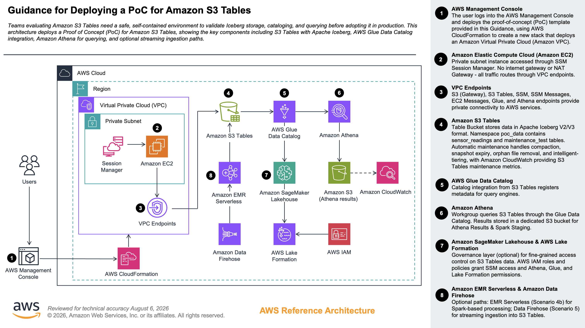

# Guidance for Deploying a PoC for Amazon S3 Tables

## Table of Contents

1. [Overview](#overview)
    - [Cost](#cost)
2. [Prerequisites](#prerequisites)
    - [Operating System](#operating-system)
    - [AWS Account Requirements](#aws-account-requirements)
    - [IAM Permissions](#iam-permissions)
    - [Supported Regions](#supported-regions)
3. [Deployment Steps](#deployment-steps)
4. [Deployment Validation](#deployment-validation)
5. [Running the Guidance](#running-the-guidance)
    - [Phase 1: Foundation](#phase-1-foundation)
    - [Phase 2: Stream Ingestion](#phase-2-stream-ingestion)
    - [Phase 3: Observability](#phase-3-observability)
    - [Phase 4: Administration](#phase-4-administration)
6. [Next Steps](#next-steps)
7. [Cleanup](#cleanup)
8. [FAQ, Known Issues, and Additional Considerations](#faq-known-issues-and-additional-considerations)
9. [Notices](#notices)

---

## Overview

This Guidance helps organizations validate a fully managed Apache Iceberg table workflow on Amazon S3 Tables by deploying a proof of concept that covers table creation, multi-engine querying, and streaming ingestion. The proof of concept connects core AWS services — including Amazon Athena, AWS Glue Data Catalog, and Amazon Data Firehose — to demonstrate how S3 Tables automatically handle compaction, snapshot management, and garbage collection without manual intervention. Private connectivity is maintained throughout, with all traffic routed securely through VPC endpoints to services such as S3, Glue, and Athena, eliminating the need for an internet gateway. You can accelerate your adoption of a modern, low-maintenance data lakehouse by validating real-world ingestion, querying, and table administration patterns before committing to a full-scale deployment.

### Architecture



### Cost

You are responsible for the cost of the AWS services used while running this Guidance. As of August 2026, the cost for running this Guidance with the default settings in the US East (N. Virginia) Region is approximately **$4.80 per month** for a continuously running proof of concept (pay-per-use only — no idle compute charges).

We recommend creating a [Budget](https://docs.aws.amazon.com/cost-management/latest/userguide/budgets-managing-costs.html) through [AWS Cost Explorer](https://aws.amazon.com/aws-cost-management/aws-cost-explorer/) to help manage costs. Prices are subject to change. For full details, refer to the pricing webpage for each AWS service used in this Guidance.

#### Sample Cost Table

The following table provides a sample cost breakdown for deploying this Guidance with the default parameters in the US East (N. Virginia) Region for one month.

| AWS Service | Dimensions | Cost [USD] |
|---|---|---|
| Amazon S3 Tables (Table Bucket) | Managed Iceberg table storage with automatic maintenance | ~$3.00 |
| Amazon Athena (Workgroup + Results Bucket) | Serverless SQL queries with a dedicated results location | ~$1.50 |
| Amazon Data Firehose (IAM Role + Backup Bucket) | Pre-configured role for streaming ingestion; backup bucket for failed records | ~$0.30 |
| **Total** | | **~$4.80/month** |

> Costs are estimates based on light PoC usage. Actual costs depend on data volume and query frequency.

---

## Prerequisites

### Operating System

These deployment instructions are optimized to work on **macOS, Linux, or Windows (WSL2)**. All AWS CLI commands are POSIX/bash compatible.

**Required tools:**

| Tool | Version | Install |
|---|---|---|
| AWS CLI | v2.x | [Install guide](https://docs.aws.amazon.com/cli/latest/userguide/install-cliv2.html) |
| Python | 3.9+ | [python.org](https://www.python.org/downloads/) |
| pip | latest | Included with Python |

For the PyIceberg notebook (Phase 1.5 Option B — local IDE), install the following packages:

```bash
pip install "pyiceberg[s3,pyarrow]" boto3 pyarrow pandas
```

### AWS Account Requirements

- An active AWS account with programmatic access configured (`aws configure` or equivalent)
- AWS CLI credentials with the IAM permissions listed below
- Amazon S3 Tables is not available in all Regions — see [Supported Regions](#supported-regions)

### IAM Permissions

The user or role running this PoC needs the following permissions. The CloudFormation stack creates a dedicated Firehose role — these are for **your** IAM principal (the person running the CLI commands and notebook).

| Permission | Why |
|---|---|
| `s3tables:*` | Create/manage table buckets, namespaces, tables, and maintenance config |
| `glue:CreateCatalog`, `glue:GetCatalog`, `glue:DeleteCatalog` | Create the federated catalog that connects S3 Tables to Athena |
| `athena:*` | Run queries, manage workgroups, register data sources |
| `s3:PutObject`, `s3:GetObject`, `s3:ListBucket`, `s3:DeleteObject` | Athena results bucket and Firehose backup bucket access |
| `firehose:CreateDeliveryStream`, `firehose:PutRecord`, `firehose:DeleteDeliveryStream`, `firehose:DescribeDeliveryStream` | Create and test the streaming ingestion path |
| `cloudformation:*` | Deploy and describe the stack |
| `iam:CreateRole`, `iam:PutRolePolicy`, `iam:PassRole` | CloudFormation creates the Firehose IAM role; CLI creates the notebook role |
| `cloudwatch:GetMetricStatistics`, `cloudwatch:ListMetrics` | View S3 Tables maintenance metrics |

**Firehose role** (created by the stack) additionally requires:

| Permission | Why |
|---|---|
| `lakeformation:GetDataAccess` | Required for Firehose to write to S3 Tables via the Glue federated catalog. This is an IAM action — no Lake Formation admin setup or grants are needed. |

> **Minimal policy for the notebook**: If running the PyIceberg notebook with a separate role, see `assets/code/notebook-role-policy.json` for the full policy (S3 Tables, Athena, Glue, Lake Formation, CloudFormation, CloudWatch, and STS permissions).

### Supported Regions

Amazon S3 Tables is available in a subset of AWS Regions. This Guidance is optimized for **US East (N. Virginia) — `us-east-1`**. Before deploying to another Region, verify that S3 Tables is supported in that Region using the [AWS Regional Services List](https://aws.amazon.com/about-aws/global-infrastructure/regional-product-services/).

---

## Deployment Steps

1. **Clone the repository:**

    ```bash
    git clone https://github.com/aws-solutions-library-samples/guidance-for-deploying-a-poc-for-amazon-s3-tables.git
    cd guidance-for-deploying-a-poc-for-amazon-s3-tables
    export AWS_REGION="us-east-1"
    ```

2. **Deploy the CloudFormation stack:**

    The stack creates the table bucket, Athena workgroup, and Firehose support resources:

    ```bash
    aws cloudformation deploy \
      --template-file assets/code/s3-tables-poc.yaml \
      --stack-name s3-tables-poc \
      --capabilities CAPABILITY_NAMED_IAM \
      --region $AWS_REGION
    ```

    > `CAPABILITY_NAMED_IAM` is required because the stack creates an IAM role for Firehose.

3. **Capture stack outputs:**

    These environment variables are used throughout the remaining steps:

    ```bash
    STACK_NAME="s3-tables-poc"

    TableBucketARN=$(aws cloudformation describe-stacks --stack-name $STACK_NAME --region $AWS_REGION \
      --query 'Stacks[0].Outputs[?OutputKey==`TableBucketARN`].OutputValue' --output text)

    TableBucketName=$(aws cloudformation describe-stacks --stack-name $STACK_NAME --region $AWS_REGION \
      --query 'Stacks[0].Outputs[?OutputKey==`TableBucketName`].OutputValue' --output text)

    AthenaWorkgroupName=$(aws cloudformation describe-stacks --stack-name $STACK_NAME --region $AWS_REGION \
      --query 'Stacks[0].Outputs[?OutputKey==`AthenaWorkgroupName`].OutputValue' --output text)

    FirehoseRoleArn=$(aws cloudformation describe-stacks --stack-name $STACK_NAME --region $AWS_REGION \
      --query 'Stacks[0].Outputs[?OutputKey==`FirehoseRoleArn`].OutputValue' --output text)

    FirehoseBackupBucketName=$(aws cloudformation describe-stacks --stack-name $STACK_NAME --region $AWS_REGION \
      --query 'Stacks[0].Outputs[?OutputKey==`FirehoseBackupBucketName`].OutputValue' --output text)

    echo "Table Bucket ARN:  $TableBucketARN"
    echo "Table Bucket Name: $TableBucketName"
    echo "Athena Workgroup:  $AthenaWorkgroupName"
    echo "Firehose Role:     $FirehoseRoleArn"
    echo "Backup Bucket:     $FirehoseBackupBucketName"

    STREAM_NAME="${STACK_NAME}-stream"
    ```

---

## Deployment Validation

Confirm the stack deployed successfully before proceeding:

1. **Check CloudFormation stack status:**

    ```bash
    aws cloudformation describe-stacks \
      --stack-name s3-tables-poc \
      --region $AWS_REGION \
      --query 'Stacks[0].StackStatus' --output text
    ```

    Expected output: `CREATE_COMPLETE`

2. **Verify resources in the AWS Console:**
    - Open the [CloudFormation console](https://console.aws.amazon.com/cloudformation) and confirm the stack `s3-tables-poc` has status **CREATE_COMPLETE**
    - Navigate to [S3 → Table buckets](https://console.aws.amazon.com/s3/home#/table-buckets) — you should see a table bucket named `s3-tables-poc-<account-id>`
    - Navigate to [Athena → Workgroups](https://console.aws.amazon.com/athena/home#/workgroups) — confirm the workgroup from `$AthenaWorkgroupName` is listed

3. **Confirm all five output variables are populated** (non-empty) from Step 3 above. If any are blank, re-run the `describe-stacks` commands for the missing values.

---

## Running the Guidance

### Phase 1: Foundation

This phase sets up the catalog integration between S3 Tables and Athena, then validates basic CRUD operations. By the end, you'll have a working table that both Athena and PyIceberg can read and write — proving multi-engine interoperability.

**What you'll do:**
1. Create a Glue federated catalog (connects S3 Tables to Athena)
2. Create a namespace (logical grouping for tables)
3. Verify the setup in the AWS Console
4. Run CRUD operations via Athena
5. Run a notebook for multi-engine batch testing

#### 1.1 Create Glue Federated Catalog

S3 Tables require a Glue federated catalog for Athena to discover and query tables. This creates the catalog with IAM-based access control (no Lake Formation admin required):

```bash
ACCOUNT_ID=$(aws sts get-caller-identity --query Account --output text)

cat > assets/code/catalog.json << EOF
{
  "Name": "s3tablescatalog",
  "CatalogInput": {
    "FederatedCatalog": {
      "Identifier": "arn:aws:s3tables:${AWS_REGION}:${ACCOUNT_ID}:bucket/*",
      "ConnectionName": "aws:s3tables"
    },
    "CreateDatabaseDefaultPermissions": [
      {
        "Principal": { "DataLakePrincipalIdentifier": "IAM_ALLOWED_PRINCIPALS" },
        "Permissions": ["ALL"]
      }
    ],
    "CreateTableDefaultPermissions": [
      {
        "Principal": { "DataLakePrincipalIdentifier": "IAM_ALLOWED_PRINCIPALS" },
        "Permissions": ["ALL"]
      }
    ],
    "AllowFullTableExternalDataAccess": "True"
  }
}
EOF

aws glue create-catalog --region $AWS_REGION --cli-input-json file://assets/code/catalog.json
aws glue get-catalog --catalog-id s3tablescatalog --region $AWS_REGION
```

> If you get `AlreadyExistsException`, that's fine — the catalog already exists from a previous setup. The `get-catalog` command confirms it's configured correctly.

Next, register the catalog as an Athena data source so it appears in the Athena console. We register the bucket-level sub-catalog directly (avoids issues with stale bucket references in the parent catalog):

```bash
aws athena create-data-catalog \
  --name $TableBucketName \
  --type GLUE \
  --parameters catalog-id=s3tablescatalog/$TableBucketName \
  --region $AWS_REGION
```

> If you get `AlreadyExistsException`, the catalog is already registered.

#### 1.2 Create Namespace

Namespaces are logical groupings within a table bucket (similar to databases). Create one for the PoC data:

```bash
aws s3tables create-namespace \
  --table-bucket-arn $TableBucketARN \
  --namespace poc_data --region $AWS_REGION
```

#### 1.3 Verify in the Console

Before running queries, confirm the resources are visible in the AWS Console:

1. Sign in to the [AWS Console](https://console.aws.amazon.com/) (if not already)
2. Navigate to [S3 → Table buckets](https://console.aws.amazon.com/s3/home#/table-buckets) — you should see `s3-tables-poc-<account-id>`
3. Click into the table bucket → confirm the `poc_data` namespace appears

This confirms the CLI-created resources are accessible via the console. You'll use the console for Athena queries next.

#### 1.4 Basic CRUD via Athena

This validates that Athena can create, read, update, and delete data in S3 Tables — confirming the catalog integration works end-to-end.

Open the Athena console and configure your query editor:

1. Navigate to the [Athena Query Editor](https://console.aws.amazon.com/athena/home#/query-editor)
2. Select the workgroup from the stack outputs (`AthenaWorkgroupName`)
3. In the **Data source** dropdown, select `s3-tables-poc-<account-id>` (your `$TableBucketName`)
4. Under **Database**, select `poc_data`

Once the catalog is selected, queries don't need the catalog prefix. Run the following queries one at a time:

**Create table** — S3 Tables are Iceberg by default, no `TBLPROPERTIES` needed:

```sql
CREATE TABLE customers (
  id INT,
  name STRING,
  email STRING,
  created_at TIMESTAMP
)
```

**Insert data:**

```sql
INSERT INTO customers VALUES
  (1, 'Alice', 'alice@example.com', current_timestamp),
  (2, 'Bob', 'bob@example.com', current_timestamp),
  (3, 'Charlie', 'charlie@example.com', current_timestamp)
```

**Query:**

```sql
SELECT * FROM customers ORDER BY id
```

**Update** — Iceberg supports row-level updates (no need to rewrite entire partitions):

```sql
UPDATE customers SET name = 'Alice Updated' WHERE id = 1
```

**Delete:**

```sql
DELETE FROM customers WHERE id = 3
```

#### 1.5 Multi-Engine Access + Batch Load (Notebook)

This step validates that PyIceberg can read/write the same tables Athena uses — confirming true multi-engine interoperability via the S3 Tables REST endpoint.

**Option A: SageMaker AI Notebook (recommended for PoC)**

Create a managed notebook instance with credentials pre-configured — no local setup needed.

First, create the IAM role for the notebook:

```bash
# Create the SageMaker execution role
aws iam create-role --role-name ${STACK_NAME}-notebook-role \
  --assume-role-policy-document '{"Version":"2012-10-17","Statement":[{"Effect":"Allow","Principal":{"Service":"sagemaker.amazonaws.com"},"Action":"sts:AssumeRole"}]}'

# Substitute stack name into policy and attach
sed "s/\${STACK_NAME}/${STACK_NAME}/g" assets/code/notebook-role-policy.json > assets/code/notebook-role-policy-resolved.json
aws iam put-role-policy --role-name ${STACK_NAME}-notebook-role \
  --policy-name S3TablesNotebookAccess \
  --policy-document file://assets/code/notebook-role-policy-resolved.json
```

Then create the notebook instance:

1. Open the [SageMaker console](https://console.aws.amazon.com/sagemaker/home#/notebook-instances/create)
2. Configure the instance:
   - **Name**: `s3-tables-poc`
   - **Instance type**: `ml.t3.medium`
   - **IAM role**: Select `s3-tables-poc-notebook-role` from the dropdown
3. Click **Create notebook instance**
4. Once status is **InService**, click **Open JupyterLab**
5. Upload `assets/code/s3_tables_poc.ipynb` from this repo into JupyterLab (drag and drop or use the Upload button)
6. Select the **conda_python3** kernel
7. Update `AWS_REGION` and `STACK_NAME` in the first code cell, then **Run All Cells**

> **Cost**: ~$0.05/hr for `ml.t3.medium`. Stop the instance from the SageMaker console when done to avoid charges.

**Option B: Local IDE (VS Code, PyCharm, JupyterLab)**

1. Ensure AWS credentials are configured. The notebook uses `boto3` which checks credentials in this order:
   - Environment variables (`AWS_ACCESS_KEY_ID`, `AWS_SECRET_ACCESS_KEY`)
   - AWS CLI profile (`aws configure` or `~/.aws/credentials`)
   - IAM Identity Center SSO (`aws sso login --profile <profile>`)

   Verify with: `aws sts get-caller-identity` — should return your account ID.
2. Open `assets/code/s3_tables_poc.ipynb` in your preferred environment
3. Install dependencies: `pip install "pyiceberg[s3,pyarrow]" boto3 pyarrow pandas`
4. Update the `AWS_REGION` and `STACK_NAME` variables in the first code cell
5. **Run All Cells**

**What the notebook does:**

| Step | Action | Validates |
|---|---|---|
| 1 | Connect to S3 Tables via PyIceberg REST catalog | SigV4 auth, catalog discovery |
| 2 | Read `customers` table (created by Athena in 1.4) | Cross-engine read (Athena → PyIceberg) |
| 3 | Write 2 rows from PyIceberg | Cross-engine write (PyIceberg → verify via Athena) |
| 4 | Create `events` table with day-level partitioning | Table creation via REST endpoint |
| 5 | Generate and load 50,000 synthetic event records | Batch ingestion (5 batches of 10K) |
| 6 | Query aggregates (by event_type, by region) | Batch load verification |
| 7 | Cross-engine verification — query via Athena | Multi-engine interoperability (PyIceberg → Athena) |
| 8 | Inspect table metadata + maintenance job status | Observability via boto3 |

After the notebook completes, verify cross-engine consistency back in the Athena query editor (with your `$TableBucketName` data source and `poc_data` database selected):

```sql
SELECT event_type, count(*) as cnt FROM events
GROUP BY event_type ORDER BY cnt DESC
```

**Expected**: ~50,000 rows across 5 event types — confirms PyIceberg-written data is readable by Athena.

---

### Phase 2: Stream Ingestion

This phase validates real-time data ingestion via Amazon Data Firehose writing directly to S3 Tables in Iceberg format.

```bash
# Ensure ACCOUNT_ID is set (also set in Phase 1.1)
ACCOUNT_ID=$(aws sts get-caller-identity --query Account --output text)
```

#### 2.1 Create Firehose Stream

Create a delivery stream that writes JSON records directly to the `events` Iceberg table. The `CatalogARN` must reference the bucket-level sub-catalog:

```bash
aws firehose create-delivery-stream \
  --delivery-stream-name $STREAM_NAME \
  --delivery-stream-type DirectPut \
  --iceberg-destination-configuration "{
    \"RoleARN\": \"${FirehoseRoleArn}\",
    \"CatalogConfiguration\": {
      \"CatalogARN\": \"arn:aws:glue:${AWS_REGION}:${ACCOUNT_ID}:catalog/s3tablescatalog/${TableBucketName}\"
    },
    \"S3Configuration\": {
      \"RoleARN\": \"${FirehoseRoleArn}\",
      \"BucketARN\": \"arn:aws:s3:::${FirehoseBackupBucketName}\"
    },
    \"BufferingHints\": { \"SizeInMBs\": 128, \"IntervalInSeconds\": 60 },
    \"DestinationTableConfigurationList\": [{
      \"DestinationDatabaseName\": \"poc_data\",
      \"DestinationTableName\": \"events\",
      \"UniqueKeys\": [\"event_id\"]
    }]
  }" --region $AWS_REGION
```

Wait for the stream to become active:

```bash
while true; do
  STATUS=$(aws firehose describe-delivery-stream \
    --delivery-stream-name $STREAM_NAME --region $AWS_REGION \
    --query 'DeliveryStreamDescription.DeliveryStreamStatus' --output text)
  echo "Stream status: $STATUS"
  [ "$STATUS" = "ACTIVE" ] && break
  sleep 10
done
```

#### 2.2 Send Test Records

Send 50 sample events spread across the past 24 hours to validate the end-to-end streaming path:

```bash
for i in $(seq 1 50); do
  OFFSET_SECONDS=$((RANDOM % 86400))
  EVENT_TIME=$(date -u -d "-${OFFSET_SECONDS} seconds" +%Y-%m-%dT%H:%M:%S 2>/dev/null || date -u -v-${OFFSET_SECONDS}S +%Y-%m-%dT%H:%M:%S)
  RECORD=$(echo -n "{\"event_id\":\"stream-$(uuidgen)\",\"event_type\":\"stream_click\",\"user_id\":$((RANDOM % 100 + 1)),\"amount\":$((RANDOM % 500)).$((RANDOM % 99)),\"event_time\":\"${EVENT_TIME}\",\"region\":\"us-east-1\"}" | base64)
  aws firehose put-record \
    --delivery-stream-name $STREAM_NAME \
    --record "{\"Data\":\"${RECORD}\"}" --region $AWS_REGION
done
```

#### 2.3 Verify Stream Ingestion

Wait 1–2 minutes for Firehose to buffer and commit, then run these queries in the Athena console (with your `$TableBucketName` data source and `poc_data` database selected):

**Count streamed records:**

```sql
SELECT event_type, count(*) as cnt, round(sum(amount),2) as total_amount
FROM events
WHERE event_type = 'stream_click'
GROUP BY event_type
```

**Time-series query — verify event distribution across the past 24 hours:**

```sql
SELECT date_trunc('hour', event_time) as hour,
       count(*) as events_per_hour,
       round(avg(amount),2) as avg_amount
FROM events
WHERE event_type = 'stream_click'
GROUP BY date_trunc('hour', event_time)
ORDER BY hour DESC
```

**Combined view — compare batch (PyIceberg) vs stream (Firehose) ingestion:**

```sql
SELECT event_type, count(*) as cnt, round(sum(amount),2) as total
FROM events
GROUP BY event_type
ORDER BY cnt DESC
```

**Expected**: ~50 `stream_click` records from Firehose alongside ~50,000 records from the PyIceberg batch load — confirms both ingestion paths write to the same Iceberg table.

> If no `stream_click` results appear after 2 minutes, check the backup bucket for failed records: `aws s3 ls s3://$FirehoseBackupBucketName/ --recursive`

---

### Phase 3: Observability

S3 Tables automatically runs maintenance jobs (compaction, snapshot management). This phase shows how to monitor them.

#### 3.1 Table Maintenance Status

> **Note**: If you just deployed the PoC, maintenance jobs will show a status of `Not_Yet_Run`. S3 Tables triggers maintenance asynchronously — compaction typically runs within 1 hour of data being written. This is expected; check back later using the Follow-On Validation schedule in the [Next Steps](#next-steps) section.

1. Open the [S3 console](https://console.aws.amazon.com/s3/home) → **Table buckets**
2. Select your table bucket → **Tables** → select `events`
3. View the **Maintenance** tab — shows compaction, snapshot management, and unreferenced file removal status

Alternatively via CLI:

```bash
aws s3tables get-table-maintenance-job-status \
  --table-bucket-arn $TableBucketARN \
  --namespace poc_data --name events --region $AWS_REGION
```

#### 3.2 CloudWatch Metrics

1. Open the [CloudWatch Metrics console](https://console.aws.amazon.com/cloudwatch/home#metricsV2)
2. Search for namespace `AWS/S3Tables`
3. Filter by dimension `TableBucketName` = your bucket name
4. Key metrics to observe:
   - `CompactionBytesCompacted` — data compacted by auto-maintenance
   - `CompactionFilesCompacted` — number of files merged
   - `SnapshotsExpired` — snapshots cleaned up

> **Note**: The `AWS/S3Tables` namespace only appears after S3 Tables runs its first maintenance job (compaction, snapshot expiry). With small datasets this may take several hours. Check the **Maintenance** tab in the S3 console first to confirm jobs have run.

---

### Phase 4: Administration

These commands configure table maintenance policies and demonstrate Iceberg features.

#### 4.1 Schema Evolution

Iceberg supports adding columns without rewriting data. Run in the Athena console (with your `$TableBucketName` data source and `poc_data` database selected):

```sql
ALTER TABLE customers ADD COLUMNS (phone STRING, tier STRING)
```

> **Idempotency note**: If you get `Cannot add column, name already exists: phone`, the columns were already added in a previous run. This is safe to ignore — Iceberg does not support `IF NOT EXISTS` for `ADD COLUMNS`, so re-running this statement is expected to fail once the columns exist.

#### 4.2 Snapshot Management

Control how many snapshots are retained and for how long. Expired snapshots are automatically cleaned up:

```bash
aws s3tables put-table-maintenance-configuration \
  --table-bucket-arn $TableBucketARN \
  --namespace poc_data --name events \
  --type icebergSnapshotManagement \
  --value '{"status":"enabled","settings":{"icebergSnapshotManagement":{"minSnapshotsToKeep":3,"maxSnapshotAgeHours":72}}}' \
  --region $AWS_REGION
```

#### 4.3 Compaction Configuration

Compaction merges small files into larger ones for better query performance. S3 Tables runs this automatically — here you can tune the target file size:

```bash
aws s3tables put-table-maintenance-configuration \
  --table-bucket-arn $TableBucketARN \
  --namespace poc_data --name events \
  --type icebergCompaction \
  --value '{"status":"enabled","settings":{"icebergCompaction":{"targetFileSizeMB":256}}}' \
  --region $AWS_REGION
```

#### 4.4 Intelligent-Tiering

Enable S3 Intelligent-Tiering on the table bucket to automatically move infrequently accessed data to lower-cost storage tiers:

```bash
aws s3tables put-table-bucket-storage-class \
  --table-bucket-arn $TableBucketARN \
  --storage-class-configuration '{"storageClass":"INTELLIGENT_TIERING"}' \
  --region $AWS_REGION
```

#### 4.5 Time Travel

Iceberg maintains snapshot history, allowing you to query data as it existed at a previous point in time. Run in the Athena console:

```sql
SELECT * FROM customers FOR TIMESTAMP AS OF TIMESTAMP '2026-05-06 06:00:00 UTC'
```

> Replace with a UTC timestamp from before your UPDATE/DELETE operations. Use `SELECT current_timestamp` to see the current time.

---

## Next Steps

### Follow-On Validation

S3 Tables runs maintenance jobs asynchronously — compaction, snapshot expiry, and tiering transitions happen in the background after data is written. Come back at these intervals to confirm they're working:

| When | What to Check | How |
|---|---|---|
| **+1 hour** | Compaction job triggered | S3 console → Table buckets → `events` → Maintenance tab |
| **+1 hour** | Snapshot count stabilized | `aws s3tables get-table-maintenance-job-status` — snapshot management should show `lastRunStatus: successful` |
| **+24 hours** | `AWS/S3Tables` CloudWatch namespace appears | CloudWatch Metrics → search `AWS/S3Tables` |
| **+24 hours** | Compaction metrics populated | `CompactionBytesCompacted`, `CompactionFilesCompacted` should have datapoints |
| **+24 hours** | File count reduced | Query `SELECT count(*) FROM events` should return same rows but with fewer underlying files (visible in table metadata) |
| **+72 hours** | Snapshot expiry runs | If you set `maxSnapshotAgeHours: 72` in Phase 4.2, old snapshots should be removed |
| **+72 hours** | Time travel window closes | Queries with `FOR TIMESTAMP AS OF` older than 72h should fail (snapshots expired) |
| **+7 days** | Intelligent-Tiering transitions | If enabled in Phase 4.4, infrequently accessed data moves to lower-cost tiers (visible in S3 storage class metrics) |

> **Tip**: If compaction hasn't run after 1 hour, your dataset may be too small to trigger it. Load more data via the notebook (increase `NUM_RECORDS` to 500K) or send more Firehose records.

### AI-Assisted Development with the AWS MCP Server

The [AWS MCP Server](https://aws.amazon.com/blogs/aws/the-aws-mcp-server-is-now-generally-available/) provides AI coding agents with authenticated access to AWS APIs, current documentation, and curated best-practice skills. Instead of manually running CLI commands, you can use an MCP-compatible agent (Kiro, Claude Code, Cursor, etc.) to create and manage S3 Tables resources interactively.

The [Agent Toolkit for AWS](https://github.com/aws/agent-toolkit-for-aws) includes **specialist storage skills** that are directly relevant to this PoC:

| Skill | What It Does |
|---|---|
| [creating-data-lake-table](https://github.com/aws/agent-toolkit-for-aws/tree/main/skills/specialized-skills/storage-skills/creating-data-lake-table) | Guides agents through creating S3 Tables (table bucket, namespace, Glue catalog, schema, partitioning, IAM access control) |
| [troubleshooting-s3-files](https://github.com/aws/agent-toolkit-for-aws/tree/main/skills/specialized-skills/storage-skills/troubleshooting-s3-files) | Diagnoses S3 access and permission issues |
| [storing-and-querying-vectors](https://github.com/aws/agent-toolkit-for-aws/tree/main/skills/specialized-skills/storage-skills/storing-and-querying-vectors) | Manages vector storage on S3 (a complementary data lake pattern) |

The `creating-data-lake-table` skill covers the same workflow as Phase 1 of this PoC — creating table buckets, namespaces, Glue catalog integration, and access control — with validated best practices for schema design, partition strategies, and IAM scoping.

To get started, configure the AWS MCP Server with your agent using the [MCP Proxy for AWS](https://github.com/aws/mcp-proxy-for-aws) and your existing IAM credentials.

---

## Cleanup

Remove all resources in reverse dependency order.

> **Why CLI + CloudFormation?** The CloudFormation stack only manages the table bucket, Athena workgroup, IAM role, and S3 buckets. Resources created via CLI during the PoC (Firehose stream, tables, namespace, Glue catalog, Athena data source) live outside the stack and must be deleted via CLI first. Additionally, CloudFormation cannot delete non-empty S3 buckets, so the Athena results and Firehose backup buckets must be emptied before stack deletion.

> **Note**: If running cleanup in a new terminal session, re-run Step 3 of the [Deployment Steps](#deployment-steps) first to restore the environment variables (`$STACK_NAME`, `$TableBucketARN`, etc.).

```bash
# 0. Delete SageMaker notebook - if created in Phase 1.5 Option A
aws sagemaker stop-notebook-instance --notebook-instance-name s3-tables-poc --region $AWS_REGION 2>/dev/null
aws sagemaker wait notebook-instance-stopped --notebook-instance-name s3-tables-poc --region $AWS_REGION 2>/dev/null
aws sagemaker delete-notebook-instance --notebook-instance-name s3-tables-poc --region $AWS_REGION 2>/dev/null
aws iam delete-role-policy --role-name ${STACK_NAME}-notebook-role --policy-name S3TablesNotebookAccess 2>/dev/null
aws iam delete-role --role-name ${STACK_NAME}-notebook-role 2>/dev/null

# 1. Delete Firehose stream
aws firehose delete-delivery-stream \
  --delivery-stream-name $STREAM_NAME --region $AWS_REGION 2>/dev/null

# 2. Delete all tables - required before namespace/bucket can be deleted
for TABLE in $(aws s3tables list-tables --table-bucket-arn $TableBucketARN \
  --namespace poc_data --query 'tables[].name' --output text --region $AWS_REGION); do
  aws s3tables delete-table --table-bucket-arn $TableBucketARN \
    --namespace poc_data --name $TABLE --region $AWS_REGION
done

# 3. Delete namespace
aws s3tables delete-namespace --table-bucket-arn $TableBucketARN \
  --namespace poc_data --region $AWS_REGION

# 4. Delete Athena data source registration
aws athena delete-data-catalog --name $TableBucketName --region $AWS_REGION 2>/dev/null

# 5. Delete Glue catalog - skip if shared with other projects
aws glue delete-catalog --catalog-id s3tablescatalog --region $AWS_REGION

# 6. Empty S3 buckets - CloudFormation cannot delete non-empty buckets
ATHENA_BUCKET=$(aws cloudformation describe-stacks --stack-name $STACK_NAME --region $AWS_REGION \
  --query 'Stacks[0].Outputs[?OutputKey==`AthenaResultsBucketName`].OutputValue' --output text)
aws s3 rm s3://${ATHENA_BUCKET} --recursive --region $AWS_REGION 2>/dev/null
aws s3 rm s3://${FirehoseBackupBucketName} --recursive --region $AWS_REGION 2>/dev/null

# 7. Delete Athena workgroup - must be empty before CloudFormation can delete it
aws athena delete-work-group --work-group ${STACK_NAME}-workgroup \
  --recursive-delete-option --region $AWS_REGION 2>/dev/null

# 8. Delete CloudFormation stack - removes table bucket, IAM roles, S3 buckets
aws cloudformation delete-stack --stack-name $STACK_NAME --region $AWS_REGION
aws cloudformation wait stack-delete-complete --stack-name $STACK_NAME --region $AWS_REGION
```

> **If stack deletion fails**: This usually means a resource still has dependencies (e.g., table bucket not fully empty, or a bucket with residual objects). Open the [CloudFormation console](https://console.aws.amazon.com/cloudformation), select the failed stack, click **Delete**, and check "Retain" for the blocking resource. Then manually delete that resource from its respective console (S3 or S3 Tables).

---

## FAQ, Known Issues, and Additional Considerations

**Known issues**

- **`AlreadyExistsException` on Glue catalog or Athena data source creation**: Safe to ignore if the resource was created in a previous run. Verify the existing resource is correctly configured using the `get-catalog` or `list-data-catalogs` commands.
- **`Not_Yet_Run` maintenance status**: Expected immediately after deployment. S3 Tables triggers compaction asynchronously; check back after 1 hour. See the [Follow-On Validation](#follow-on-validation) schedule.
- **`AWS/S3Tables` CloudWatch namespace not visible**: The namespace only appears after the first maintenance job runs. With small datasets this may take several hours.
- **Firehose stream records not appearing in Athena**: Firehose buffers up to 60 seconds before committing. If records are still missing after 2 minutes, check the backup bucket: `aws s3 ls s3://$FirehoseBackupBucketName/ --recursive`

**Additional considerations**

- This Guidance creates an Amazon SageMaker notebook instance (Option A) that is billed per hour irrespective of usage. Stop the instance from the SageMaker console when not in use.
- The Glue federated catalog (`s3tablescatalog`) created in Phase 1.1 is account-wide. If you have other S3 Tables projects using the same catalog name, skip the deletion step in Cleanup (Step 5) to avoid disrupting those workloads.
- S3 Tables pricing is based on storage and requests. For large-scale production workloads, review the [S3 Tables pricing page](https://aws.amazon.com/s3/pricing/) before committing to a full deployment.

For any feedback, questions, or suggestions, please use the issues tab under this repo.

---

## Notices

Customers are responsible for making their own independent assessment of the information in this Guidance. This Guidance: (a) is for informational purposes only, (b) represents AWS current product offerings and practices, which are subject to change without notice, and (c) does not create any commitments or assurances from AWS and its affiliates, suppliers or licensors. AWS products or services are provided "as is" without warranties, representations, or conditions of any kind, whether express or implied. AWS responsibilities and liabilities to its customers are controlled by AWS agreements, and this Guidance is not part of, nor does it modify, any agreement between AWS and its customers.
